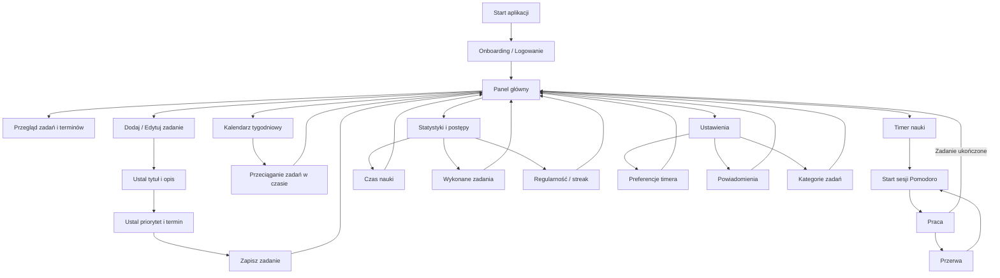

```mermaid
flowchart TD
    A[Start aplikacji] --> B[Onboarding / Logowanie]
    B --> C[Panel główny]

    C --> D[Przegląd zadań i terminów]
    C --> E[Dodaj / Edytuj zadanie]
    C --> F[Kalendarz tygodniowy]
    C --> G[Timer nauki]
    C --> H[Statystyki i postępy]
    C --> I[Ustawienia]

    E --> E1[Ustal tytuł i opis]
    E1 --> E2[Ustal priorytet i termin]
    E2 --> E3[Zapisz zadanie]
    E3 --> C

    F --> F1[Przeciąganie zadań w czasie]
    F1 --> C

    G --> G1[Start sesji Pomodoro]
    G1 --> G2[Praca]
    G2 --> G3[Przerwa]
    G3 --> G1
    G2 -->|Zadanie ukończone| C

    H --> H1[Czas nauki]
    H --> H2[Wykonane zadania]
    H --> H3[Regularność / streak]
    H1 --> C
    H2 --> C
    H3 --> C

    I --> I1[Preferencje timera]
    I --> I2[Powiadomienia]
    I --> I3[Kategorie zadań]
    I1 --> C
    I2 --> C
    I3 --> C

```
